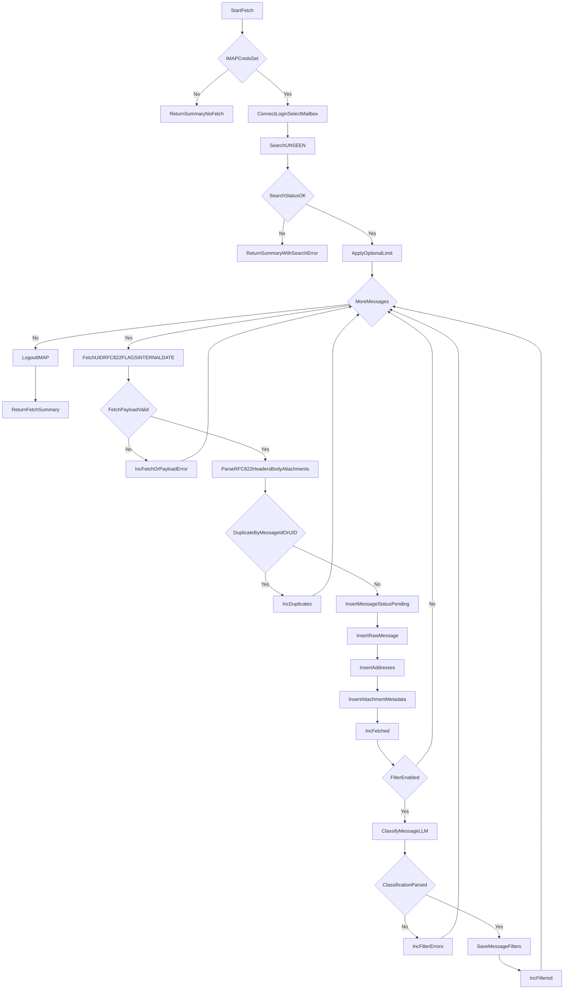
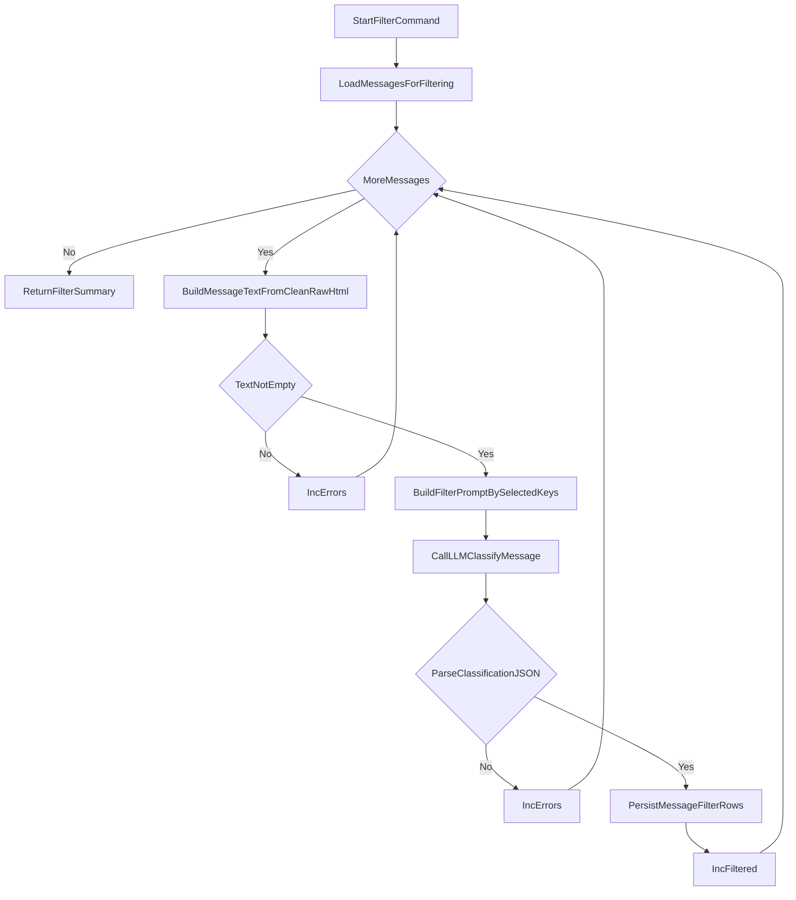
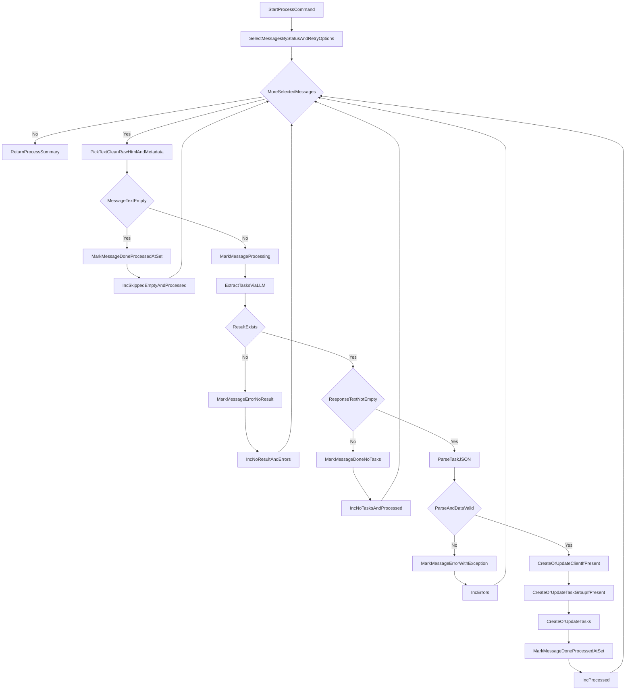
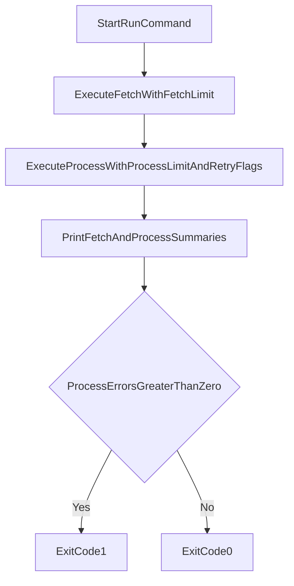

# Core Operation Flowcharts

## 1) `taskh fetch`

## 2) `taskh filter`

## 3) `taskh process`

## 4) `taskh run`

## Assumptions
- Flowcharts model current implementation paths only.
- Attachment metadata persistence is implemented; attachment text extraction is not yet in the active processing flow.
