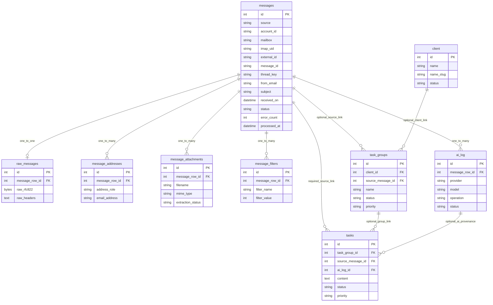
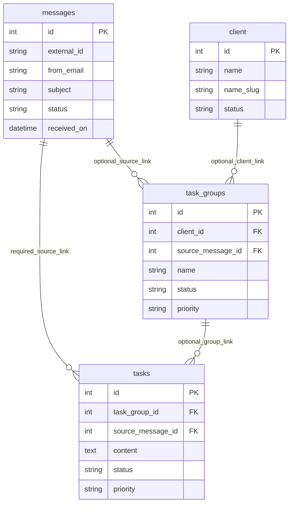

# Entity-Relationship Diagram

## Full Schema ERD

## Minimal Core ERD

## Assumptions
- Optional links correspond to nullable foreign keys in current SQLAlchemy models.
- Diagram captures schema-level truth, not future intended constraints.
