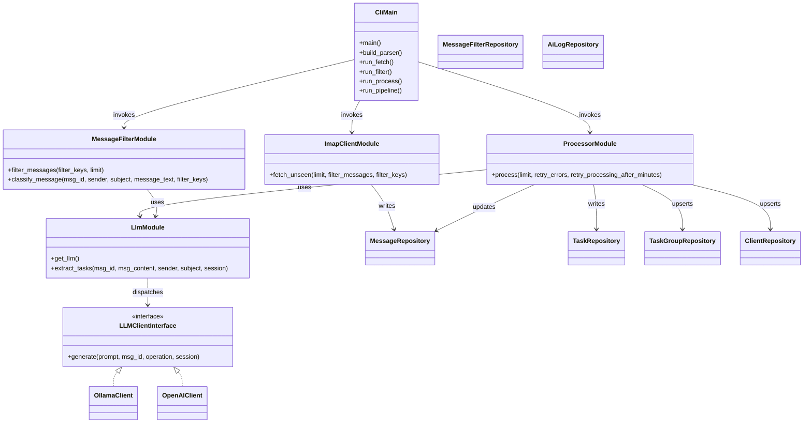
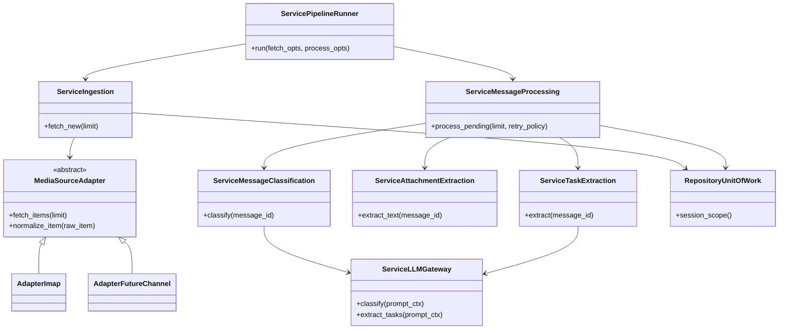

# Class Diagram

## Current Structure (module-oriented)

## Proposed Refactor Target (service-oriented)

## Assumptions
- Current diagram reflects actual module boundaries, not a strict object-oriented domain model.
- Proposed diagram is incremental and designed to preserve current repository and model assets.
