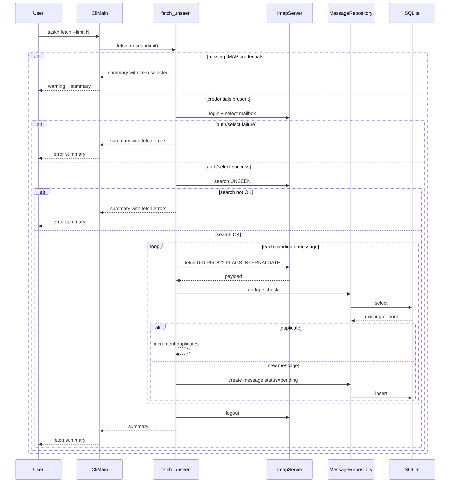
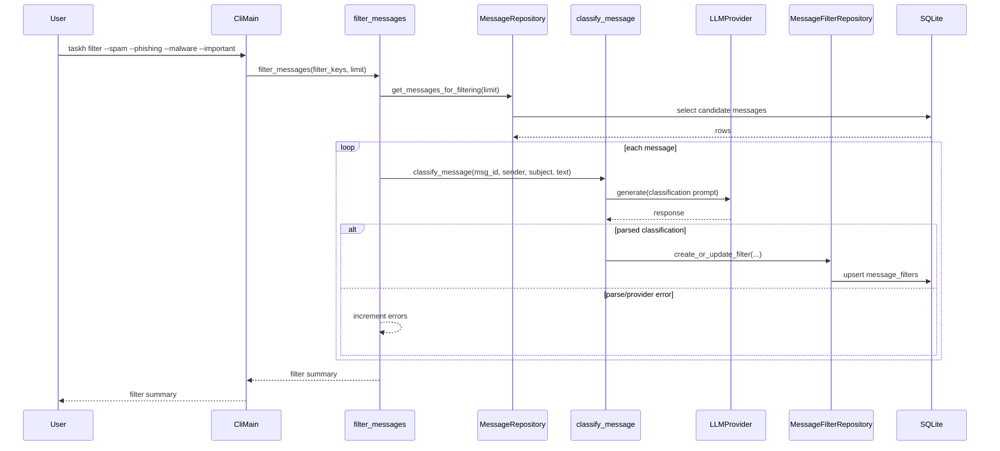
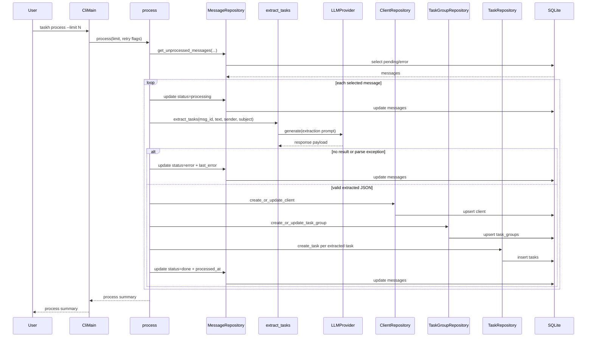
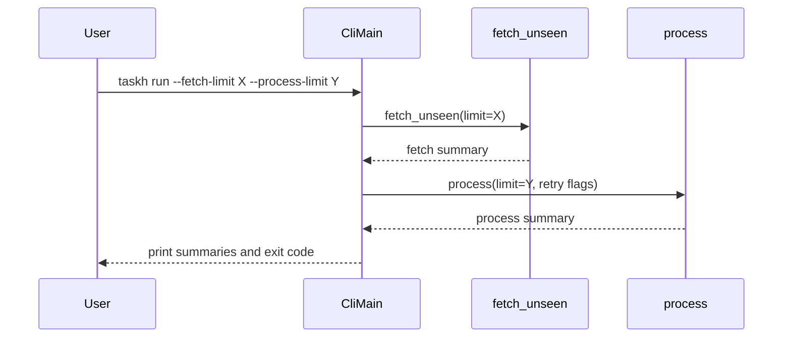

# Sequence Diagrams

## 1) `taskh fetch` (with failure branches)

## 2) `taskh filter`

## 3) `taskh process`

## 4) `taskh run`

## Assumptions
- Sequence diagrams reflect current implementation behavior and CLI/module interactions.
- AI logging internals are omitted to keep diagrams readable.
