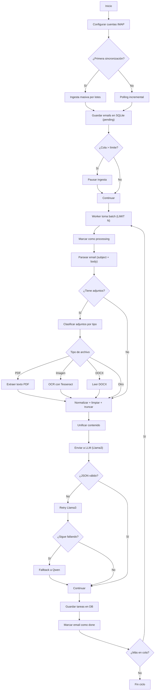

```mermaid
flowchart TD

    A[Inicio] --> B[Configurar cuentas IMAP]

    B --> C{¿Primera sincronización?}

    C -->|Sí| D[Ingesta masiva por lotes]
    C -->|No| E[Polling incremental]

    D --> F[Guardar emails en SQLite #40;pending#41;]
    E --> F

    F --> G{¿Cola > límite?}
    G -->|Sí| H[Pausar ingesta]
    G -->|No| I[Continuar]

    H --> I

    I --> J[Worker toma batch #40;LIMIT N#41;]

    J --> K[Marcar como processing]

    K --> L[Parsear email #40;subject + body#41;]

    L --> M{¿Tiene adjuntos?}

    M -->|Sí| N[Clasificar adjuntos por tipo]
    M -->|No| S[Normalizar texto]

    N --> O{Tipo de archivo}

    O -->|PDF| P[Extraer texto PDF]
    O -->|Imagen| Q[OCR con Tesseract]
    O -->|DOCX| R[Leer DOCX]
    O -->|Otro| S

    P --> S
    Q --> S
    R --> S

    S[Normalizar + limpiar + truncar] --> T[Unificar contenido]

    T --> U[Enviar a LLM #40;Llama3#41;]

    U --> V{¿JSON válido?}

    V -->|No| W[Retry Llama3]
    W --> X{¿Sigue fallando?}

    X -->|Sí| Y[Fallback a Qwen]
    X -->|No| Z[Continuar]

    V -->|Sí| Z

    Y --> Z

    Z --> AA[Guardar tareas en DB]

    AA --> AB[Marcar email como done]

    AB --> AC{¿Más en cola?}

    AC -->|Sí| J
    AC -->|No| AD[Fin ciclo]
```